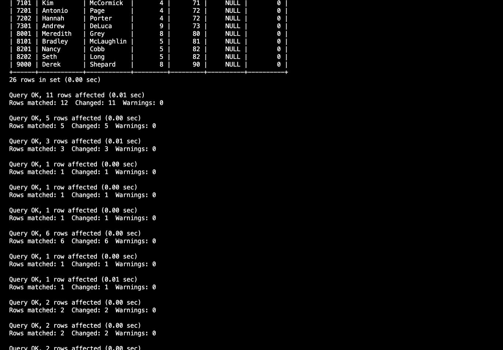
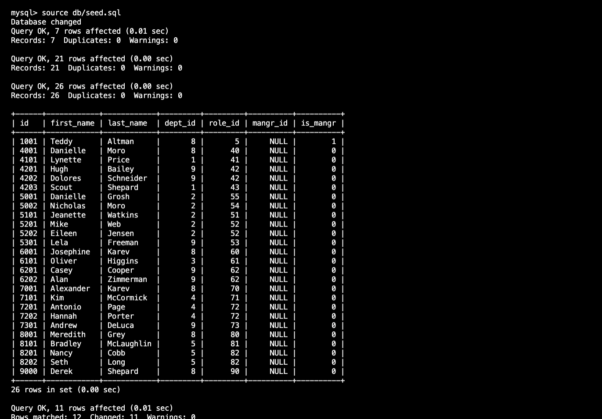
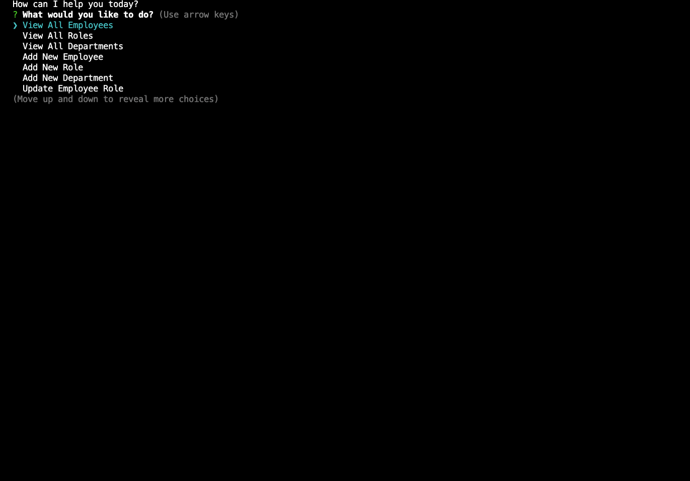

# SQLEmployeeTracker

1. [Description](#Description)
2. [Installation](#Installation)
3. [Usage](#Usage)
4. [Deployment](#Deployment)
5. [Screenshots](#Screenshots)

## Description
The app creates a database to track employees in a company using mysql. Employees can be added or removed. Any information related to the employee may also be updated using mysql.

## Installation
To install the app, the user should download or copy the code into their personal coding environment. Once it is downloaded the app can be initiated by:

    1. Open a new terminal and type the following commands.
    2. <ls> make sure you are in the correct directory
    3. <npm install> and <npm install console.table --save> should be run to install the necessary dependencies
    4. Enter MySQl by running <mysql -u root -p>
    5. Run <source db/schema.sql> and <source dbseed.sql> in mysql 
    6. exit mysql by typing <quit>
    7. Run <node index>
    8. Follow the prompts to complete the required task

## Usage
Anyone can clone or fork the repo. Once you download the app just follow the instruction prompts in the terminal. 
 

## Deployment

Video Link: [Google Drive Link to Video]()

Repo Link: [https://github.com/sytrejo/SQLEmployeeTracker](https://github.com/sytrejo/SQLEmployeeTracker)

## Screenshots

